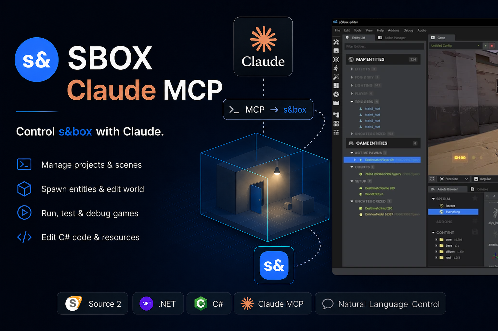

# sbox-mcp

> **Control Facepunch's s&box engine with Claude.** A plugin that lets any MCP-aware LLM client drive scenes, components, and a running game through natural language. Talk things into existence.

  

---

## Features

- **🗺️ Manage projects & scenes** — open, save, and navigate your scene graph from natural-language prompts.
- **✨ Spawn entities & edit world** — place props, configure components, set transforms. No menu hunting.
- **🐛 Run, test & debug** — drive a *running* game from your prompts. Spawn enemies, tweak globals, dump runtime state.
- **🛠️ Edit C# code & resources** — write `Component` scripts, refactor existing ones, tight feedback loop with the editor's hot-reload.
- **🔌 Works with any MCP client** — Claude Code, Cursor, or any LLM client speaking Model Context Protocol.

## Try it

> "Place a red bouncing cube at the camera origin and make it spawn three children when clicked."

> "Write me a `Component` that plays a sound on overlap and attach it to the prop I have selected."

> "While the game is running, spawn 50 zombies in a circle around the player."

## Get it

**Coming soon to [sbox.game](https://sbox.game).** Watch this repo for the release announcement.

## Support

If sbox-mcp saves you time, you can support continued development:

- 
- 

## Built with

- [s&box](https://sbox.game) — Facepunch's modern Source 2 + .NET 10 game engine
- [Model Context Protocol](https://modelcontextprotocol.io) — Anthropic's open standard for AI tool integration
- [.NET 10](https://dotnet.microsoft.com) + [Roslyn](https://github.com/dotnet/roslyn) — runtime, codegen, and reflection

---

By [@314159DD](https://github.com/314159DD).
