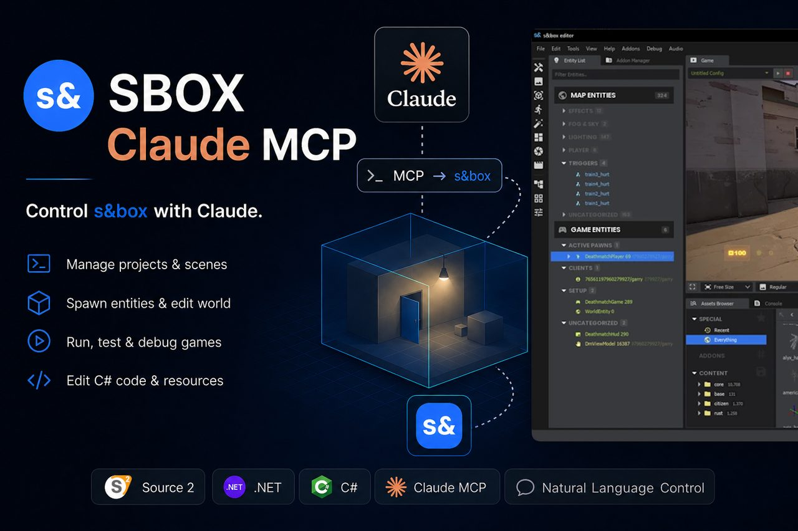

# sbox-mcp

> A Model Context Protocol server that runs inside Facepunch's s&box editor, so any MCP-aware LLM client (Claude Code, Cursor, and others) can drive scenes, components, code, and a running game through natural language.

[](https://github.com/314159DD/sbox-mcp/actions/workflows/test.yml)
[](LICENSE)
[](https://dotnet.microsoft.com)
[](https://github.com/Facepunch/sbox-public)
[](https://github.com/modelcontextprotocol/csharp-sdk)

**Status: early.** The plugin skeleton, the in-editor MCP server, the JSON-driven tool registry, and a first `health_check` round trip are implemented and unit-tested. The engine-facing tool surface (scene graph, codegen, runtime control) is designed but not yet built. See [Roadmap](#roadmap).

---

## How it works

`sbox-mcp` is a single C# / .NET 10 plugin DLL. The s&box mount loader calls its static constructor on load, which boots a Kestrel host with the official MCP .NET SDK and exposes a Streamable HTTP endpoint on `127.0.0.1:8080`. No second process, no Python bridge, no external port.

```
  MCP client (Claude Code, Cursor, ...)
        |
        |  MCP tool call  (Streamable HTTP, 127.0.0.1:8080)
        v
  +-----------------------------------------------+
  |  sbox-mcp plugin DLL   (in-editor, .NET 10)   |
  |                                               |
  |  Bootstrap  -> ToolConfig (tools.json)        |
  |             -> ToolRegistry                   |
  |             -> McpServerHost (Kestrel + SDK)  |
  |             -> AssemblyObserver (hot reload)  |
  +-----------------------------------------------+
        |
        |  in-process .NET API call
        v
  s&box editor / runtime
```

Design choices, with the reasoning written down at the time:

- [Single-process, all-C# plugin](docs/decisions/2026-04-28-architecture-single-process.md) instead of a Python sidecar. One DLL to drop in, no orchestration, tool calls cost a few milliseconds.
- [Hybrid tool design, reflective first](docs/decisions/2026-04-28-tool-design-hybrid.md). Generic reflection tools cover the whole engine API surface first; curated primitives and macros are layered on top once real LLM usage shows where the friction is.
- [Distribution through the sbox.game addon marketplace](docs/decisions/2026-04-28-distribution-via-sbox-game.md), with this repo as the open source of truth.

## What is implemented

| Area | State |
|---|---|
| Plugin bootstrap (`Bootstrap.cs`) | Composition root; loads config, builds the registry, starts the server, logs failures |
| MCP server host (`McpServerHost.cs`) | Kestrel on `127.0.0.1:8080`, stateless Streamable HTTP transport, MCP .NET SDK 1.2 |
| Tool config (`ToolConfig.cs`, `config/tools.json`) | Tool names, descriptions, and JSON schemas loaded from a file so they can be edited without a rebuild |
| Tool registry (`ToolRegistry.cs`, `ITool.cs`) | Name-keyed registry with duplicate detection |
| `health_check` tool | Returns plugin version and uptime; the first end-to-end round trip |
| Lifecycle (`AssemblyObserver.cs`, `EditorEventHandlers.cs`) | Hot-reload observation and editor event hooks, wired behind `TODO (Task 11)` markers until the engine bindings land |
| Tests | 10 xUnit tests over the health tool, config loading, and the registry |

The full engine wiring (`[SkipHotload]`, `[Event]` handlers, `Sandbox.Log`, `PackageLoader.CreateEnroller`) is marked in the source and tracked in the roadmap. The manual smoke test inside the s&box editor has not been run yet.

## Roadmap

Three tiers, built in order. The full table with sprint numbers is in [docs/roadmap.md](docs/roadmap.md).

| Tier | Tools | Purpose |
|---|---|---|
| R: Reflective generics | `describe_type`, `list_types`, `find_components`, `set_property`, `get_property`, `call_method`, `list_entities`, `create_entity`, `attach_component`, `read_file`, `write_file`, `apply_patch`, `compile_status`, `runtime_status`, `save_scene`, `load_scene` | Cover the whole engine API surface through reflection so the system is demoable end to end |
| C: Curated primitives | `create_component`, `edit_component`, `set_transform`, `parent_entity`, `place_object`, `import_model`, `set_material`, `spawn_at_runtime`, `mutate_global`, `dump_runtime_state` | Ergonomic per-domain operations, informed by observed LLM behaviour on Tier R |
| M: Macros | `create_configured_entity`, `place_with_behavior`, `duplicate_entity`, `snap_to_grid` | Atomic create-and-configure flows for high-frequency patterns |

The bar for "done" is building a small playable scene from zero entirely through the MCP, without touching the editor menus.

## Build and install

```bash
git clone https://github.com/314159DD/sbox-mcp.git
cd sbox-mcp/plugin
dotnet build -c Release

# Copy the output into your s&box installation:
#   <sbox-install>/mount/sbox-mcp/sbox-mcp.dll
# Launch s&box. The MCP server starts with the editor.
```

Then point an MCP client at `http://127.0.0.1:8080`. For Claude Code:

```json
{
  "sbox": { "transport": "http", "url": "http://127.0.0.1:8080" }
}
```

Requirements: s&box public source (2026-04-28 or later), .NET SDK 10.0, an MCP client with Streamable HTTP transport.

## Testing

```bash
cd plugin
dotnet test tests/sbox-mcp.tests.csproj
```

10 tests: `health_check` name and payload shape, uptime on a fresh start, config parsing (valid, malformed, missing tools), and registry behaviour (register and retrieve, unknown tool, duplicate name, name listing). CI runs a Release build plus the test project on every push and pull request.

## Project structure

```
plugin/
  sbox-mcp.csproj             .NET 10 library, MCP SDK + Roslyn references
  config/tools.json           tool names, descriptions, JSON schemas
  src/
    Bootstrap.cs              composition root, static ctor entry point
    Server/McpServerHost.cs   Kestrel + MCP SDK host on 127.0.0.1:8080
    Tools/                    ITool, ToolConfig, ToolRegistry, HealthCheckTool
    Lifecycle/                AssemblyObserver, EditorEventHandlers
  tests/                      xUnit test project
docs/
  vision.md                   what the project is for
  roadmap.md                  tiers, phases, sprints, status
  decisions/                  architecture decision records
  research/                   engine internals notes (plugin model, events, Roslyn at runtime, port whitelist)
.github/workflows/test.yml    build + test on ubuntu-latest
```

## License

MIT. See [LICENSE](LICENSE).

## Acknowledgments

- [Facepunch](https://facepunch.com) for s&box and for releasing the engine source.
- The [Model Context Protocol](https://modelcontextprotocol.io) working group and the [official .NET MCP SDK](https://github.com/modelcontextprotocol/csharp-sdk).
